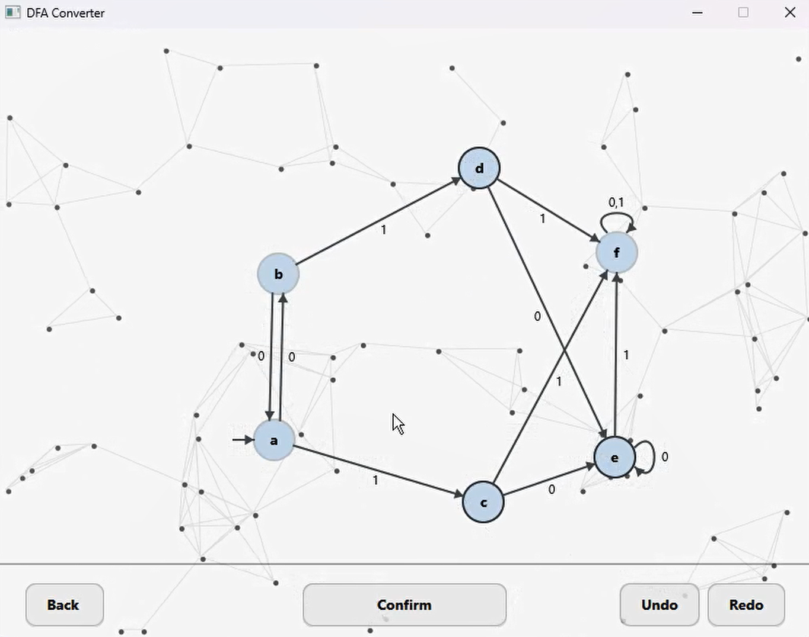
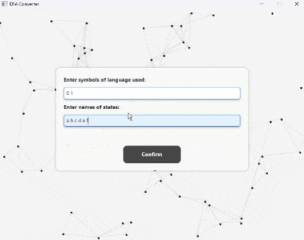

# DFA Minimizer and Visualizer


This project provides a JavaFX-based tool for visualizing, editing, and minimizing DFAs (Deterministic Finite Automata). It helps users observe, analyze, and optimize state machines with an intuitive interface.


## Features
- **DFA Visualization:** Ability to visually draw and manipulate DFAs.
- **DFA Minimization:** Automated tools for minimizing DFAs using efficient algorithms.
- **Interactive State Management:** Draggable states and intuitive controls for managing state transitions.
- **Built with Java and JavaFX:** This project is implemented using Java and JavaFX for an interactive user experience.


## Installation and Usage
1. **Clone the Repository:**
   ```bash
   https://github.com/amir-azari/DFA-Minimizer-JavaFX.git

## Contributing
We welcome your contributions! Please report issues or submit pull requests for collaboration.

## Contact
For questions or feedback, please reach out to me:
- Email: ah.azari.wr@gmail.com


## How to add input

- **Defining Symbols:** Symbols should be separated by spaces. For example: `a b c`.
- **Defining States:** States should be separated by spaces. For example: `q1 q2 q3`.

## How to Draw DFA

- **Adding States:** `Right-click` on the canvas to add a state.
- **Dragging States:** States can be dragged by `left-clicking` and holding.
- **Selecting Start and Final States:** You can select states for transitions by holding `CTRL` + `left-clicking` on them.
- **Defining Final and Start States:** Double `left-click` on a state to mark it as a final state or a start state, or to remove these designations.
- **Changing Position of Self-loop States:** `left-click` on self-loop states to change their position.
- **Managing Transitions:** You can manage transitions using `Undo` and `Redo` functionality.
- **Updating Transitions:** Transitions can be updated as needed.

## Demo


<p float="left" align="center">
  
  
</p>
<div align="center">
  
</div>


